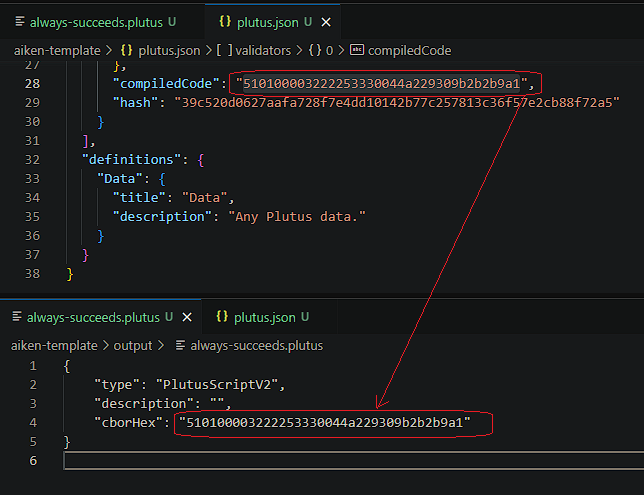

# Introduction

This is documentation that gives you a step-by-step guide on how to compile a Aiken script into UPLC. If you successfully compile the script, look at plutus.json file and there is compiledCode, which is a CBOR that part of UPLC and it can be used on-chain.

# Step by step

In this documentation, there are two methods to set up the environment. We can use [demeter.run](https://demeter.run/) or our local machine, choose one.

## Setup Environment

### On Demeter

1. Use demeter.run, if you haven’t an account then create new account
2. Add resource and select workspace
3. In the toolchain section, select Aiken
4. Select a large workspace size
5. Select a network. In this example, we'll use Preprod
6. Run the workspace and wait a moment. After provisioning is complete, then open the VSCode feature in the browser

### On Local Machine

1. Install Cargo / Rust Package Manager
   If you're using linux or macOS, run:

   ```bash
   curl https://sh.rustup.rs -sSf | sh
   ```

   if you're using windows, download and run [rustup-init.exe](https://win.rustup.rs/)

   **_After executing it, it will appear like this:_**

   ```text
   1. Quick install via the Visual Studio Community installer
      (free for individuals, academic uses, and open source).

   2. Manually install the prerequisites
      (for enterprise and advanced users).

   3. Don't install the prerequisites
      (if you're targeting the GNU ABI).
   ```

   **_Recommendation choose number 1_**

   ```text
   1) Proceed with standard installation (default - just press enter)
   2) Customize installation
   3) Cancel installation
   ```

   **_Recommendation choose number 1_**

2. Check Rust and Cargo Version

   **_Hint: After the installation is completed, you should restart the terminal_**

   ```bash
   rustc --version
   cargo --version
   ```

3. Install Aiken

   ```bash
   cargo install aiken --version 1.0.24-alpha
   ```

   **_Note: To get the latest Aiken version, go to [Aiken Installation Intructions Official Site](https://aiken-lang.org/installation-instructions)_**

4. Check Aiken Version

   **_Hint: After the installation is completed, you should restart the terminal_**

   ```bash
   aiken --version
   ```

   **_Note: You will know you are successful if you can run_**

## Open a Bash Terminal in the VSCode

1. Create New Aiken Project

   ```bash
   aiken new aiken-lang/aiken-template
   ```

2. Go to aiken-template Directory

   ```bash
   cd aiken-template
   ```

3. Create an always_succeeds.ak File, Which is a Validator Script

   ```bash
   touch validators/always_succeeds.ak
   ```

4. Copy and Paste The Example Validator Script to always_succeeds.ak File

   ```rust
   validator {
     fn always_succeed(_datum: Data, _redeemer: Data, _context: Data) -> Bool {
         True
     }
   }
   ```

   **_Note: This is a simple validator script where the output is always true._**

5. Build / Compile Validator Script

   ```bash
   aiken build
   ```

   **_Result: Look at the plutus.json file, there is compiledCode, which is the same as CBOR._**

6. Create Output Directory and always-succeeds.plutus File

   ```bash
   mkdir -p output && touch output/always-succeeds.plutus
   ```

7. Copy and paste UPLC template to always-succeeds.plutus File

   ```json
   {
     "type": "PlutusScriptV2",
     "description": "",
     "cborHex": "49480100002221200101"
   }
   ```

8. Replace CBOR Hex

   In the always-succeeds.plutus file, replace CBOR value string with the compiledCode value string from the plutus.json file as shown in the image below:

   

   If you’re done, then congratulation! you've successfully compiled the Aiken validator script into UPLC.

# Demo

The following is a video recorded by the Indonesian Cardano Developers Community where I demonstrated the steps above. Watch the recorded video at timestamp **_1:27:27_**, here is the [link](https://youtu.be/03hXLZ_07N0?list=PLUj8499OocHiL8gXPv8wMlLW-zIcyYdrQ)

# References

[Cardano Developers Portal: Plutus](https://developers.cardano.org/docs/smart-contracts/plutus/)

[Plutus Core and PlutusTx User Guide](https://plutus.readthedocs.io/en/latest/explanations/platform.html)

[The Plutus Compilation Pipeline: Understanding Plutus Core](https://well-typed.com/blog/2022/08/plutus-cores/)

[CBOR Documentation](https://cbor.io/)

[Gimbalabs PPBL Module 101: Plutus Terminology](https://plutuspbl.io/modules/101/slts)

[Gimbalabs PPBL Module 101.1: Introducing UPLC](https://plutuspbl.io/modules/101/1011)

[Gimbalabs PPBL Module 101.2: The Role of UPLC](https://plutuspbl.io/modules/101/1012)

[Gimbalabs PPBL Module 101.5: Compiling Aiken](https://plutuspbl.io/modules/101/1015)

[Cardano Academy](https://academy.cardanofoundation.org/)
