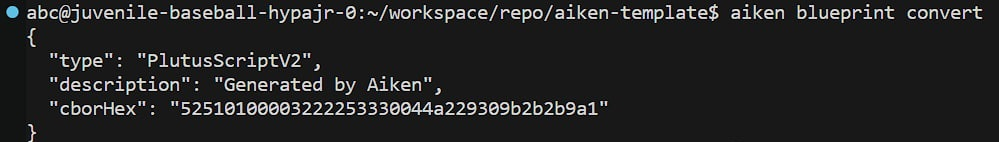

# Introduction

This documentation provides a simplified, step-by-step guide on how to compile an Aiken script into UPLC. After you successfully compile the script, run _'aiken blueprint convert'_ in the terminal. You will see UPLC, which has a CBOR format that will be used on-chain.

# Step by step

In this documentation, there are two methods to set up the environment. We can use [demeter.run](https://demeter.run/) or our local machine, choose one.

## Step-1 Setup Environment

### On Demeter

1. Use [demeter.run](https://demeter.run/), if you haven’t an account then create new account
2. Add resource and select workspace
3. In the toolchain section, select Aiken
4. Select a large workspace size
5. Select a network. In this example, we'll use Preprod
6. Run the workspace and wait a moment. After provisioning is complete, then open the VSCode feature in the browser

### On Local Machine

1. Install Cargo / Rust Package Manager
   If you're using linux or macOS, run:

   ```bash
   curl https://sh.rustup.rs -sSf | sh
   ```

   if you're using windows, download and run [rustup-init.exe](https://win.rustup.rs/)

   **_After executing it, it will appear like this:_**

   ```text
   1. Quick install via the Visual Studio Community installer
      (free for individuals, academic uses, and open source).

   2. Manually install the prerequisites
      (for enterprise and advanced users).

   3. Don't install the prerequisites
      (if you're targeting the GNU ABI).
   ```

   **_Recommendation choose number 1_**

   ```text
   1) Proceed with standard installation (default - just press enter)
   2) Customize installation
   3) Cancel installation
   ```

   **_Recommendation choose number 1_**

2. Check Rust and Cargo Version

   **_Hint: After the installation is completed, you should restart the terminal_**

   ```bash
   rustc --version
   cargo --version
   ```

3. Install Aiken

   ```bash
   cargo install aiken --version 1.0.24-alpha
   ```

   **_Note: To get the latest Aiken version, go to [Aiken Installation Intructions Official Site](https://aiken-lang.org/installation-instructions)_**

4. Check Aiken Version

   **_Hint: After the installation is completed, you should restart the terminal_**

   ```bash
   aiken --version
   ```

   **_Note: You will know you are successful if you can run_**

## Step-2 Open a Bash Terminal in the VSCode

1. Create New Aiken Project

   ```bash
   aiken new aiken-lang/aiken-template
   ```

2. Go to aiken-template Directory

   ```bash
   cd aiken-template
   ```

3. Create an always_succeeds.ak File, Which is a Validator Script

   ```bash
   touch validators/always_succeeds.ak
   ```

4. Copy and Paste The Example Validator Script to always_succeeds.ak File

   ```rust
   validator {
     fn always_succeed(_datum: Data, _redeemer: Data, _context: Data) -> Bool {
         True
     }
   }
   ```

   **_Note: This is a simple validator script where the output is always true._**

5. Build / Compile Validator Script

   ```bash
   aiken build
   ```

## Step-3 See the Result

1. Create Output Directory and always-succeeds.plutus File

   ```bash
   mkdir -p output && touch output/always-succeeds.plutus
   ```

2. Blueprint Convert

   ```bash
   aiken blueprint convert
   ```

   **_Hint: After running the blueprint convert command, it will appear in the terminal as shown in the image below_**

   

3. Copy and paste the UPLC template that appears in the terminal

# Demo

The following is a video recorded by the Indonesian Cardano Developers Community where I demonstrated the steps above. Watch the recorded video at timestamp **_1:27:27_**, here is the [link](https://youtu.be/03hXLZ_07N0?list=PLUj8499OocHiL8gXPv8wMlLW-zIcyYdrQ)

# References

[Gimbalabs PPBL2023 Module 101: Plutus Terminology](https://plutuspbl.io/modules/101/slts)

[Gimbalabs PPBL2023 Module 101.1: Introducing UPLC](https://plutuspbl.io/modules/101/1011)

[Gimbalabs PPBL2023 Module 101.2: The Role of UPLC](https://plutuspbl.io/modules/101/1012)

[Gimbalabs PPBL2023 Module 101.5: Compiling Aiken](https://plutuspbl.io/modules/101/1015)

[Cardano Developer Portal: Plutus](https://developers.cardano.org/docs/smart-contracts/plutus/)

[Demeter](https://demeter.run/)
