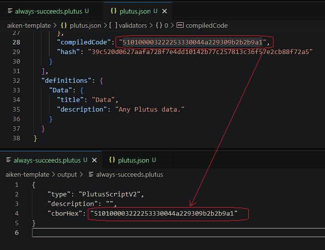

# Pendahuluan

Ini adalah dokumentasi yang memberikan panduan langkah demi langkah cara mengompilasi skrip Aiken menjadi UPLC. Jika Anda berhasil mengompilasi skrip, lihatlah file plutus.json dan di dalamnya terdapat compiledCode, yang merupakan bagian CBOR dari UPLC dan dapat digunakan di on-chain.

# Langkah-langkah

Dalam dokumentasi ini, terdapat dua metode untuk menyiapkan lingkungan. Kita dapat menggunakan demeter.run atau mesin lokal kita, pilih salah satu.

## Setup Environment

### Demeter

1. Gunakan demeter.run, jika Anda belum memiliki akun, maka buatlah akun baru.
2. Tambahkan resource dan pilih workspace.
3. Pada bagian toolchain, pilih Aiken.
4. Pilih ukuran large workspace.
5. Pilih network. Pada contoh kali ini, kita akan menggunakan Preprod.
6. Jalankan workspace dan tunggu sebentar. Setelah penyiapan selesai, maka buka fitur VSCode browser.

### Lokal

1. Instalasi Cargo / Rust Package Manager
   Jika Anda menggunakan Linux / macOS, eksekusi:

   ```bash
   curl https://sh.rustup.rs -sSf | sh
   ```

   Jika Anda menggunakan Windows, download lalu eksekusi [rustup-init.exe](https://win.rustup.rs/)

   **_Kemudian muncul seperti ini:_**

   ```text
   1. Quick install via the Visual Studio Community installer
      (free for individuals, academic uses, and open source).

   2. Manually install the prerequisites
      (for enterprise and advanced users).

   3. Don't install the prerequisites
      (if you're targeting the GNU ABI).
   ```

   **_Rekomendasi pilih nomor 1_**

   ```text
   1) Proceed with standard installation (default - just press enter)
   2) Customize installation
   3) Cancel installation
   ```

   **_Rekomendasi pilih nomor 1_**

2. Periksa Versi Rust dan Cargo

   **_Petunjuk: Setelah proses instalasi selesai, sebaiknya restart terminal_**

   ```bash
   rustc --version
   cargo --version
   ```

3. Instalasi Aiken

   ```bash
   cargo install aiken --version 1.0.24-alpha
   ```

   **_Catatan: Untuk mendapatkan Aiken versi terbaru, kunjungi [Aiken Installation Intructions Official Site](https://aiken-lang.org/installation-instructions)_**

4. Periksa Versi Aiken

   **_Petunjuk: Setelah proses instalasi selesai, sebaiknya restart terminal_**

   ```bash
   aiken --version
   ```

   **_Catatan: Anda mengetahui bahwa Aiken berhasil terinstall jika dapat melihat versi Aiken tersebut_**

## Buka Terminal Bash di VSCode

1. Buat Proyek Aiken Baru

   ```bash
   aiken new aiken-lang/aiken-template
   ```

2. Menuju direktori aiken-template

   ```bash
   cd aiken-template
   ```

3. Membuat File always_succeeds.ak, Yang Merupakan Skrip Validator

   ```bash
   touch validators/always_succeeds.ak
   ```

4. Copy dan Paste Contoh Skrip Validator Berikut ke File always_succeeds.ak

   ```rust
   validator {
     fn always_succeed(_datum: Data, _redeemer: Data, _context: Data) -> Bool {
         True
     }
   }
   ```

   **_Catatan: Ini adalah contoh validator sederhana yang outputnya selalu berlogika true._**

5. Build / Kompilasi Skrip Validator

   ```bash
   aiken build
   ```

   **_Hasil: Lihat di file plutus.json, disitu terdapat compilerCode yang merupakan CBOR._**

6. Buat Direktori Output dan File always-succeeds.plutus

   ```bash
   mkdir -p output && touch output/always-succeeds.plutus
   ```

7. Copy dan paste template UPLC berikut ke File always-succeeds.plutus

   ```json
   {
     "type": "PlutusScriptV2",
     "description": "",
     "cborHex": "49480100002221200101"
   }
   ```

8. Ganti CBOR Hex

   Pada file Always-succeeds.plutus, ganti string CBOR dengan string compilerCode dari file plutus.json seperti pada gambar di bawah ini:

   

   Jika sudah selesai, selamat! Anda telah berhasil mengkompilasi skrip validator Aiken ke dalam UPLC.

# Demo

Berikut adalah video yang direkam oleh Komunitas Developer Cardano Indonesia di mana saya menjelaskan langkah-langkah di atas. Tonton video yang direkam pada timestamp **_1:27:27_** di [link](https://youtu.be/03hXLZ_07N0?list=PLUj8499OocHiL8gXPv8wMlLW-zIcyYdrQ) berikut ini.

# References

[Cardano Developers Portal: Plutus](https://developers.cardano.org/docs/smart-contracts/plutus/)

[Plutus Core and PlutusTx User Guide](https://plutus.readthedocs.io/en/latest/explanations/platform.html)

[The Plutus Compilation Pipeline: Understanding Plutus Core](https://well-typed.com/blog/2022/08/plutus-cores/)

[CBOR Documentation](https://cbor.io/)

[Gimbalabs PPBL Module 101: Plutus Terminology](https://plutuspbl.io/modules/101/slts)

[Gimbalabs PPBL Module 101.1: Introducing UPLC](https://plutuspbl.io/modules/101/1011)

[Gimbalabs PPBL Module 101.2: The Role of UPLC](https://plutuspbl.io/modules/101/1012)

[Gimbalabs PPBL Module 101.5: Compiling Aiken](https://plutuspbl.io/modules/101/1015)

[Cardano Academy](https://academy.cardanofoundation.org/)
