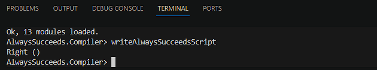
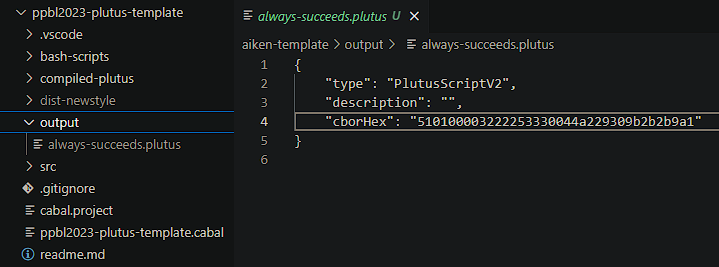

# Introduction

This is documentation that gives you a step-by-step guide on how to compile a PlutusTx script into UPLC. If you successfully compile the script, you will find a file with a **_.plutus_** extension, which is a UPLC. This UPLC has a CBOR format that can be used on-chain.

When installing the Plutus environment on our local machine, it can require significant effort. However, there is an alternative. We can use [demeter.run](https://demeter.run/), which provides Cardano infrastructures, tools, libraries, and, of course, the Plutus environment.

# Step by step

## Setup Demeter

1. Use demeter.run, if you haven’t an account then create new account
2. Add resource and select workspace
3. In the toolchain section, select PlutusTx
4. Select a large workspace size
5. Select a network. In this example, we'll use Preprod
6. Run the workspace and wait a moment. After provisioning is complete, then open the VSCode feature in the browser

## Open a Bash Terminal in the VSCode

1. Clone Gimbalabs PPBL2023 Plutus Template

   ```bash
   git clone https://gitlab.com/gimbalabs/ppbl-2023/ppbl2023-plutus-template.git
   ```

2. Go to PPBL2023 Plutus Template Directory

   ```bash
   cd ppbl2023-plutus-template
   ```

3. Create an Output Directory Where This is The Place For .plutus Files

   ```bash
   mkdir output
   ```

4. Run Cabal

   ```bash
   cabal update
   cabal repl
   ```

5. In the repl, run:

   ```repl
   writeAlwaysSucceedsScript
   ```

## Result

If you successfully execute the writeAlwaysSucceedsScript, the result will be shown as right() in the terminal, and in the output directory, you'll find a file named always-succeeds.plutus, as shown in the image below:





Then congratulations! You've successfully compiled the PlutusTx validator script into UPLC

# Demo

The following is a video recorded by the Indonesian Cardano Developers Community where I demonstrated the steps above. Watch the recorded video at timestamp **_1:27:27_**, here is the [link](https://youtu.be/03hXLZ_07N0?list=PLUj8499OocHiL8gXPv8wMlLW-zIcyYdrQ)

# References

[Cardano Developers Portal: Plutus](https://developers.cardano.org/docs/smart-contracts/plutus/)

[Plutus Core and PlutusTx User Guide](https://plutus.readthedocs.io/en/latest/explanations/platform.html)

[The Plutus Compilation Pipeline: Understanding Plutus Core](https://well-typed.com/blog/2022/08/plutus-cores/)

[CBOR Documentation](https://cbor.io/)

[Gimbalabs PPBL Module 101: Plutus Terminology](https://plutuspbl.io/modules/101/slts)

[Gimbalabs PPBL Module 101.1: Introducing UPLC](https://plutuspbl.io/modules/101/1011)

[Gimbalabs PPBL Module 101.2: The Role of UPLC](https://plutuspbl.io/modules/101/1012)

[Gimbalabs PPBL Module 101.3: Compiling PlutusTx](https://plutuspbl.io/modules/101/1013)

[Cardano Academy](https://academy.cardanofoundation.org/)
