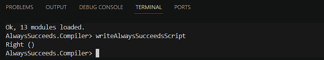

# Pendahuluan

Ini adalah dokumentasi yang memberikan panduan langkah demi langkah tentang cara mengompilasi skrip PlutusTx menjadi UPLC. Jika Anda berhasil mengompilasi skrip, Anda akan menemukan file dengan ekstensi .plutus, yang merupakan UPLC, memiliki format CBOR yang dapat digunakan di on-chain.

Ketika menginstal Plutus environment di mesin lokal kita, hal itu membutuhkan usaha yang signifikan. Namun, ada alternatifnya, kita dapat menggunakan [demeter.run](https://demeter.run/) yang menyediakan infrastruktur, tools, library di Cardano, dan tentu saja ada Plutus environment.

# Langkah-langkah

## Setup Demeter

1. Use demeter.run, if you haven’t an account then create new account
2. Add resource and select workspace
3. In the toolchain section, select PlutusTx
4. Select a large workspace size
5. Select a network. In this example, we'll use Preprod
6. Run the workspace and wait a moment. After provisioning is complete, then open the VSCode feature in the browser

7. Gunakan demeter.run, jika Anda belum memiliki akun, maka buatlah akun baru.
8. Tambahkan resource dan pilih workspace.
9. Pada bagian toolchain, pilih PlutusTx.
10. Pilih ukuran large workspace.
11. Pilih network. Pada contoh kali ini, kita akan menggunakan Preprod.
12. Jalankan workspace dan tunggu sebentar. Setelah penyiapan selesai, maka buka fitur VSCode browser.

## Buka Terminal Bash di Browser VSCode

1. Lakukan Clone Gimbalabs PPBL2023 Plutus Template

```bash
git clone https://gitlab.com/gimbalabs/ppbl-2023/ppbl2023-plutus-template.git
```

2. Menuju ke Direktori PPBL2023 Plutus Template

```bash
cd ppbl2023-plutus-template
```

3. Buat Direktori Output Dimana Ini Adalah Tempatnya File .plutus

```bash
mkdir output
```

4. Jalankan Cabal

```bash
cabal update
cabal repl
```

5. Ketika masuk repl, jalankan:

```repl
writeAlwaysSucceedsScript
```

## Hasil

Jika Anda berhasil menjalankan skrip writeAlwaysSucceedsScript, di terminal akan muncul **_right()_**, dan di dalam direktori output, Anda akan menemukan sebuah file bernama **_always-succeeds.plutus_**, seperti yang ditunjukkan dalam gambar di bawah ini:




Selamat! Anda telah berhasil mengompilasi skrip validator PlutusTx menjadi UPLC.

# Demo

Berikut adalah video yang direkam oleh Komunitas Pengembang Cardano Indonesia di mana saya menjelaskan langkah-langkah di atas. Tonton video yang direkam pada timestamp **_1:27:27_** di [link](https://youtu.be/03hXLZ_07N0?list=PLUj8499OocHiL8gXPv8wMlLW-zIcyYdrQ) berikut ini.

# Referensi

[Cardano Developers Portal: Plutus](https://developers.cardano.org/docs/smart-contracts/plutus/)

[Plutus Core and PlutusTx User Guide](https://plutus.readthedocs.io/en/latest/explanations/platform.html)

[The Plutus Compilation Pipeline: Understanding Plutus Core](https://well-typed.com/blog/2022/08/plutus-cores/)

[CBOR Documentation](https://cbor.io/)

[Gimbalabs PPBL Module 101: Plutus Terminology](https://plutuspbl.io/modules/101/slts)

[Gimbalabs PPBL Module 101.1: Introducing UPLC](https://plutuspbl.io/modules/101/1011)

[Gimbalabs PPBL Module 101.2: The Role of UPLC](https://plutuspbl.io/modules/101/1012)

[Gimbalabs PPBL Module 101.3: Compiling PlutusTx](https://plutuspbl.io/modules/101/1013)

[Cardano Academy](https://academy.cardanofoundation.org/)
